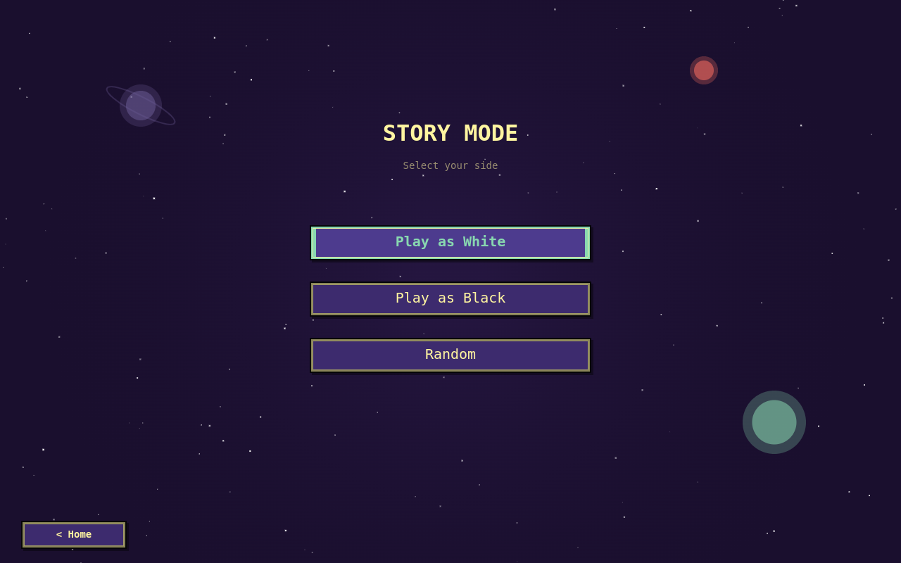
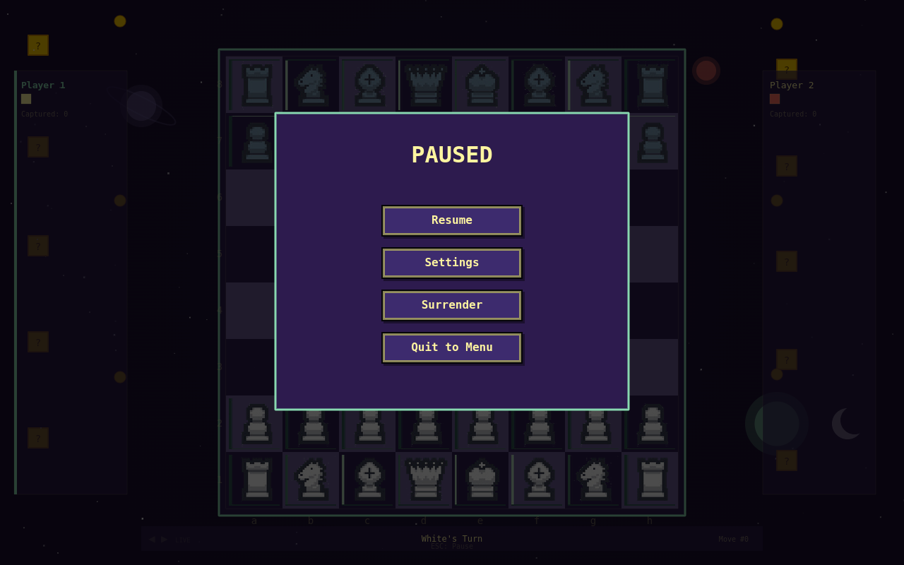

<p align="center">
  
</p>

<p align="center">
  <strong>A fully-featured pixel-art chess game built with Electron and vanilla JavaScript.</strong>
</p>

<p align="center">
  
  
  
  
  
  
</p>

<p align="center">
  Play classic chess, challenge unique characters in Story Mode, or battle a friend in local 1v1.<br/>
  Featuring dynamic themes, character dialogue, capture minigames, and a custom chess engine with AI opponents.
</p>

---

## Screenshots

<p align="center">

| Home Screen | Mode Select | Game Screen |
|:---:|:---:|:---:|
|  |  |  |

| Character Select | Theme Select | Pause Menu |
|:---:|:---:|:---:|
|  |  |  |

</p>

---

## Features

| Feature | Description |
|:--------|:------------|
| **Story Mode** | Battle 5 unique characters with personality-driven dialogue and escalating difficulty |
| **Local 1v1** | Two players on the same machine with full chess rules |
| **Classic Chess** | Play against the built-in AI engine with adjustable depth (10 difficulty levels) |
| **Dynamic Themes** | 3+ visual styles (Space, Medieval, Ocean) with unique color palettes and unlockable themes |
| **Character System** | Each opponent has unique dialogue, colors, and AI personality |
| **Capture Minigames** | 13 skill-based minigames trigger on piece captures for bonus rewards |
| **Particle Effects** | Animated stars, explosions, and visual feedback |
| **Save System** | Persistent settings, unlocked themes, and progress tracking via localStorage |
| **Custom Engine** | Full legal move generation, check/checkmate detection, and AI search with alpha-beta pruning |
| **Fullscreen** | Toggle fullscreen mode with F11 |

---

## Game Modes

### Story Mode

Face off against 5 themed opponents in order of difficulty:

| Level | Character | Title | Personality |
|:-----:|:----------|:------|:------------|
| 1 | Pawnie | The Village Rookie | Nervous |
| 2 | Bish-Bosh | The Diagonal Dreamer | Enthusiastic |
| 3 | Rook-E | The Iron Tower | Stoic |
| 4 | KnightShade | The Shadow Lancer | Mysterious |
| 5 | Queenie | The Royal Tyrant | Arrogant |

Each character greets you before battle and reacts to victory or defeat.

### Local 1v1

Two players take turns on the same keyboard. Standard chess rules apply.

### Classic Chess

Play against the AI with full control over search depth and difficulty. The AI uses alpha-beta pruning with piece-square tables and material evaluation across 10 difficulty levels.

---

## Themes

Switch between visual themes that change the entire board, pieces, UI, and background:

| Theme | Name | Description |
|:-----:|:-----|:------------|
| `space` | Cosmic Abyss | Rainbow road in the cosmos |
| `medieval` | King's Fortress | Brick blocks and flags |
| `ocean` | Deep Blue | Bubbles and coral pipes |

Themes affect board colors, piece colors, highlights, backgrounds, buttons, panels, text, and particle effects. Additional themes can be unlocked through gameplay.

---

## Capture Minigames

When a piece is captured, a skill minigame may trigger (30% chance, toggleable in Settings). Win the minigame for bonus rewards:

| Minigame | Skill Tested |
|:---------|:-------------|
| Quick Click | Speed clicking |
| Memory Match | Pattern memory |
| Timing Strike | Precise timing |
| Pattern Press | Sequence input |
| Reaction Test | Reflexes |
| Undertale Dodge | Bullet dodging |
| Power Meter | Charge control |
| Bar Balance | Balance keeping |
| Target Practice | Aiming |
| Dodge Falling | Avoidance |
| Rhythm Tap | Rhythm timing |
| Number Guess | Logic deduction |
| Coin Flip | Chance |

Difficulty scales based on the value of the captured piece.

---

## Controls

| Key | Action |
|:---:|:-------|
| `Arrow Keys` / `WASD` | Navigate menus, move cursor on board |
| `Enter` / `Space` | Select / Confirm |
| `Escape` | Back / Pause |
| `F` | Flip board (in-game) |
| `H` | Toggle move hints (in-game) |
| `P` | Toggle particles (in-game) |
| `F11` | Toggle fullscreen |

---

## Getting Started

### Prerequisites

- [Node.js](https://nodejs.org/) v20+
- npm (comes with Node.js)

### Clone & Run

```bash
git clone https://github.com/iGLORM/chess.git
cd chess
npm install
npm start
```

### Linux Desktop Entry (Optional)

```bash
chmod +x launch.sh
./launch.sh
```

---

## Architecture

```
src/
  audio/          Sound and music management (Web Audio API)
  characters/     Character definitions and manager
  engine/         Chess engine (board, moves, rules, AI)
    ai/           Alpha-beta search, evaluation, difficulty controller
  input/          Keyboard input and keybindings
  minigames/      13 skill-based capture minigames
  rendering/      Canvas rendering (board, pieces, particles, textures)
  screens/        UI screens (home, game, menus, settings)
  state/          Global reactive state store
  themes/         Theme definitions and manager
  main.js         Game loop and screen router
  index.html      Entry point
```

| File | Purpose |
|:-----|:--------|
| `main.js` | Electron main process |
| `preload.js` | Secure preload script (context isolation) |
| `src/main.js` | Game bootstrap, loop, and screen routing |
| `src/index.html` | Module loader |

Textures and sprites are procedurally generated at runtime using the `SpriteGen` and `TextureManager` modules. The `assets/textures/` folder supports custom texture packs.

---

## Roadmap

- [ ] Online multiplayer
- [ ] More themes (Forest, Lava, Ice)
- [ ] Additional characters with unique AI strategies
- [ ] Game replay / PGN export
- [ ] Mobile / touch support
- [ ] Elo rating system

---

## License

This project is open source. See [LICENSE](LICENSE) for details.

---

## Acknowledgments

- Pixel art aesthetic inspired by retro arcade games
- Chess piece values and evaluation based on standard engine principles
- Built with love for the game of chess
